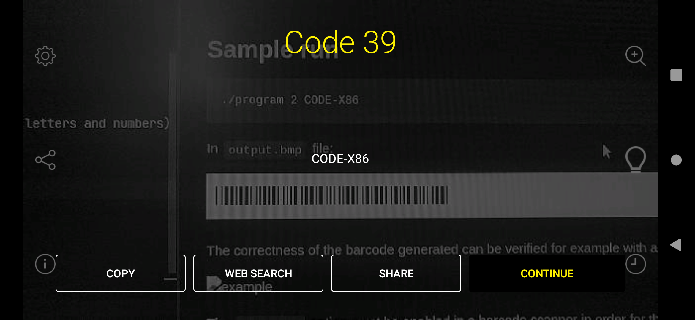
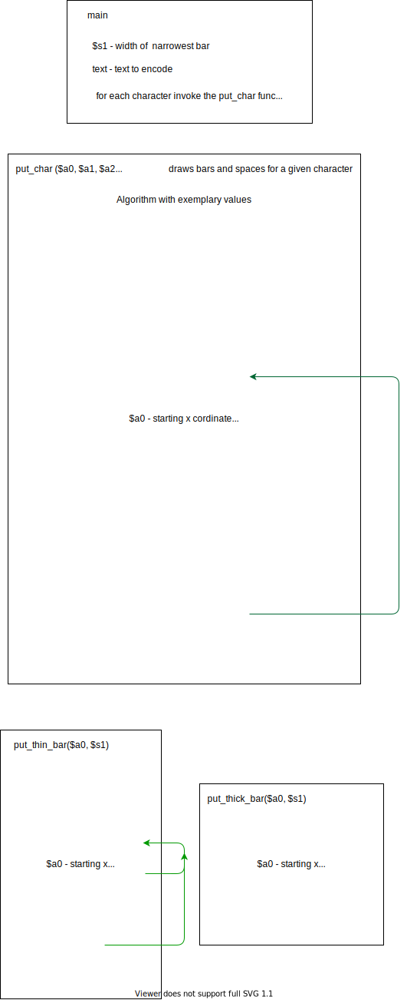

# Barcode generator

## This project is the 3rd in a series on Assembly programming
1. MIPS Assembly
* [Short programming tasks solved](https://github.com/whiteeagle44/MIPS-Assembly)
* [Program generating barcode for a given string](https://github.com/whiteeagle44/barcode-generator)
2. x86 Assembly 
* [Program generating barcode in 32-bit x86 NASM](https://github.com/whiteeagle44/barcode-generator-x86) **(You're here)**
* [Tutorial on how to configure an IDE for x86 NASM on Linux](https://www.eagle44.io/blog/how-to-configure-an-ide-for-x86-nasm-on-linux/)

## About
This program generates a [Code 39](https://en.wikipedia.org/wiki/Code_39) barcode for a given string. In other words, it draws the appropriate sequences of bars and spaces into a bmp file.

Details of the task can be found in `task.pdf` file.

## How to run
This project is precompiled for Linux.
Open terminal in the folder with files.

Type `./program  width_of_narrow_bar text_to_be_encoded`

Where:

`width_of_narrow_bar` - 1, 2 or 3

`text_to_be_encoded`  - sequence of up to 9 characters (uppercase letters, numbers and [more](https://en.wikipedia.org/wiki/Code_39#/media/File:Free_3_of_9_(Code_39_barcode).svg))

A barcode will be generated in the `output.bmp` file.

## Sample run
```
./program 2 CODE-X86
```

In `output.bmp` file:


The correctness of the barcode generated can be verified for example with an Android app:



## Implementation
The source for the program is located in `main.c` and `functions.asm` files. It is written in C and 32 bit x86 assembly language. The simplified logic of the core functions in pseudocode is presented in form of diagrams below. 
The diagrams were created with the MIPS implementation in mind, but are valid in the x86 case as well. 


 
